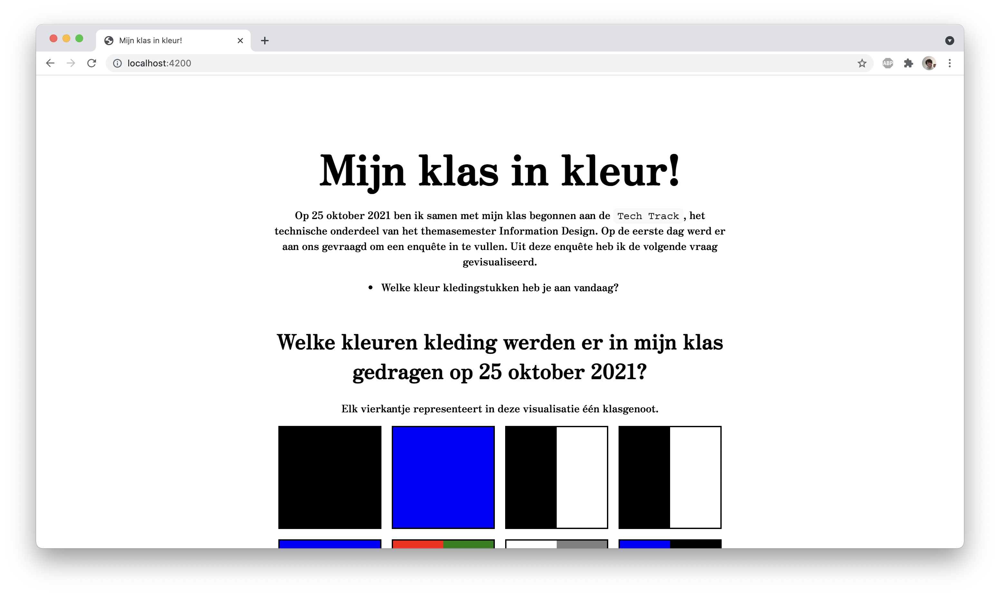

# functional-programming

## 📋 My concepts

### 🟥 Week 1

Hi! Welcome to my repository for the two week course functional-programming! Here you can find the website I produced during the first week of this course.

We were tasked to write functions that could parse some data into a more suitable form. These functions had to adhere to the functional programming paradigm. The data we had to use was gathered by a questionnaire that me and my classmates had to complete on the first day of the course. This questionnaire contained the following question.

- What color garments are you wearing today?

I used the answers to this question to create my visualizations. Feel free to clone this repository and take a look!

> **NOTE:** The content on this website is completely written in Dutch!



### 💾 Week 2

During the second week of this course I was tasked to fetch and clean some data from an external API. I decided to use the [Star Wars API](https://swapi.dev/) and the [PokéAPI](https://pokeapi.co/) for this assignment. To first get a deeper understanding of using the fetch API I challenged myself to not use the `await` and `async` keywords in my implementation of the Star Wars API. To practice these keywords I did use them in my implentation of the PokéAPI.

The code for my implementation of the Star Wars API can be found in the [`week2old` folder](https://github.com/Steinberg99/functional-programming/tree/main/week2old). My implementation of the PokéAPI is located in the [`week2` folder](https://github.com/Steinberg99/functional-programming/tree/main/week2) of this repository.

## 🧑‍💻 How to install

### Week 1

> **NOTE:** Before you can install this project be sure to have both [Node.js](https://nodejs.org/en/download/) and NPM installed. NPM should automatically be installed when installing Node.js.

You can install my project locally by running the following command in your local folder.

- `git clone https://github.com/Steinberg99/functional-programming`

When you have cloned my repository run the command `npm install` to install all of the project dependencies. Run this command in the local folder where you cloned my project. When you have done this you can run the command `npm start` to start the project. The website should run in the browser when visiting `localhost:4200`.

### Week 2

To run my implementations of the Star Wars API and the PokeAPI you navigate to their aforementioned folders in the console. Before you can run these implementations using Node.js you need to add the following line somewhere into the `package.json` file.

`"type": "module",`

Doing this is required because node-fetch can only be imported with the `import` statement instead of the `require()` function. Once this line has been added the files can be run using the following command in the corresponding folder.

- `node swapi.js` in the `week2old` folder to run my implementation of the Star Wars API.
- `node pokemon.js` in the `week2` folder to run my implementation of the PokéAPI.

The results of these scripts should be logged to the console. The following objects are examples of the expected outcome.

```javascript
{
    name: 'Luke Skywalker',
    gender: 'male',
    height: '172',
    mass: '77',
    homeworld: {
        name: 'Tatooine',
        climate: 'arid',
        terrain: 'desert'
    }
  }
```

```javascript
{
    name: 'Bulbasaur',
    types: [ 'grass', 'poison' ],
    weight: 69,
    height: 7,
    image_url: 'https://raw.githubusercontent.com/PokeAPI/sprites/master/sprites/pokemon/1.png'
}
```

## 💻 Technologies

During this project I made use of the following technologies or libraries.

- [Node.js](https://nodejs.org/en/download/),
- [Express](https://expressjs.com/),
- [Pug](https://pugjs.org/api/getting-started.html),
- [Node Fetch](https://www.npmjs.com/package/node-fetch)

## ✍️ Author and license

Author: [Stein Bergervoet](https://github.com/Steinberg99/), license: [MIT License](https://github.com/Steinberg99/functional-programming/blob/main/LICENSE).

[](https://opensource.org/licenses/MIT)
